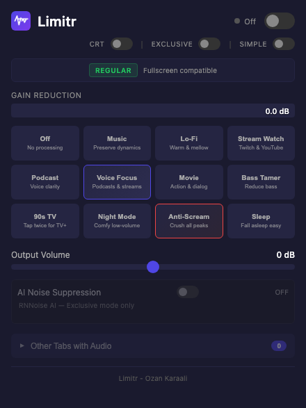
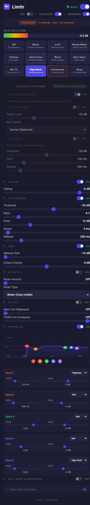

# Limitr

A browser extension for real-time audio compression, limiting, EQ, and normalization. Perfect for streaming sites where audio levels can vary wildly.





## Features

- **Real-time audio processing** using the Web Audio API
- **Simple & Advanced modes**: Quick presets or full control over every parameter
- **8 Audio Presets**:
  - **Off** - No processing (bypass)
  - **Voice Focus** - Multiband compression + EQ optimized for speech and podcasts
  - **Stream Watch** - Single-band compression with auto-gain for streams
  - **Music** - Light compression preserving dynamics
  - **Night Mode** - Aggressive compression + auto-gain for quiet listening
  - **Movie** - Multiband compression taming explosions while preserving dialog
  - **Bass Tamer** - Heavy compression with bass reduction
  - **90s TV** - Warm CRT-style sound with bass/treble cut, noise, and optional TV+ visual mode
- **Single-band compressor** with full parameter control (threshold, ratio, knee, attack, release)
- **3-band multiband compressor** with independent per-band threshold, ratio, and gain
- **5-band parametric EQ** with selectable filter types per band
- **Brick-wall limiter** with adjustable threshold (-30 to 0 dB) for auto-leveling and clipping prevention
- **Bass & Treble Cut** filters for additional frequency shaping
- **Background noise** (white/pink/brown) for vintage audio effect
- **Gain reduction meter** showing real-time compression activity
- **Collapsible sections** with independent on/off toggles per processing block
- **Two processing modes**: Regular (fullscreen-friendly) or Exclusive (multi-tab with AI features)
- **Exclusive mode extras**: AI noise suppression (RNNoise) and auto-gain (AGC)
- **No external dependencies** (except RNNoise WASM for AI noise suppression)

## Installation

### Chrome Web Store

Coming soon

### Chrome / Chromium-based browsers (Manual)

1. Open `chrome://extensions/`
2. Enable "Developer mode" (toggle in top right)
3. Click "Load unpacked"
4. Select the `limitr` folder

### Firefox

1. Open `about:debugging#/runtime/this-firefox`
2. Click "Load Temporary Add-on"
3. Select any file in the `limitr` folder (e.g., `manifest.json`)

Note: For permanent Firefox installation, the extension needs to be signed or installed via `about:config` with `xpinstall.signatures.required` set to `false`.

## Usage

1. Click the Limitr icon in your browser toolbar
2. Toggle the master switch to enable/disable processing
3. Select a preset or switch to Advanced mode for full control
4. Each processing section (Compressor, Gain, EQ, Limiter, Filters, Effects) can be independently toggled on/off and collapsed
5. The gain reduction meter shows real-time compression activity

## Advanced Parameters

### Compressor

| Parameter | Range | Description |
|-----------|-------|-------------|
| Threshold | -60 to 0 dB | Level above which compression begins |
| Ratio | 1:1 to 20:1 | Amount of compression applied |
| Knee | 0 to 40 dB | Smoothness of compression onset |
| Attack | 0 to 100 ms | How quickly compression engages |
| Release | 10 to 1000 ms | How quickly compression releases |

### Gain

| Parameter | Range | Description |
|-----------|-------|-------------|
| Makeup Gain | 0 to 24 dB | Volume boost after compression |
| Output Gain | -24 to +24 dB | Final volume adjustment (master) |

### 5-Band Parametric EQ

| Parameter | Range | Description |
|-----------|-------|-------------|
| Frequency | 20 to 20000 Hz | Center frequency per band |
| Gain | -12 to +12 dB | Boost/cut per band |
| Q | 0.1 to 10 | Bandwidth (narrow to wide) |
| Type | Highpass/Lowshelf/Peaking/Highshelf/Lowpass | Filter shape per band |

### Limiter

| Parameter | Range | Description |
|-----------|-------|-------------|
| Threshold | -30 to 0 dB | Ceiling above which audio is brick-wall limited |

### Multiband Compressor

| Parameter | Range | Description |
|-----------|-------|-------------|
| Crossover 1 | 20 to 500 Hz | Split point between sub and mid bands |
| Crossover 2 | 500 to 10000 Hz | Split point between mid and high bands |
| Band Threshold | -60 to 0 dB | Per-band compression threshold |
| Band Ratio | 1:1 to 20:1 | Per-band compression amount |
| Band Gain | -12 to +12 dB | Per-band output gain |

### Filters

| Parameter | Range | Description |
|-----------|-------|-------------|
| Bass Cut (Highpass) | 0 to 300 Hz | Removes frequencies below this value |
| Treble Cut (Lowpass) | 2000 to 22050 Hz | Removes frequencies above this value |

### Effects

| Parameter | Range | Description |
|-----------|-------|-------------|
| Noise Level | 0 to 30% | Background noise amount |
| Noise Type | White/Pink/Brown | Noise character (harsh to cozy) |

### Exclusive Mode Only

| Parameter | Range | Description |
|-----------|-------|-------------|
| AI Noise Suppression | On/Off | RNNoise-based background noise removal |
| Auto-Gain (AGC) | On/Off | Automatic level control |
| AGC Target | -30 to 0 dB | Target loudness for auto-gain |

## How It Works

### Signal Chain

```
Source → [Compressor OR Multiband] → [Bass Cut] → [5-Band EQ] → [Treble Cut] → [Limiter] → Output Gain → Destination
```

Each block in brackets is optional — only wired into the chain when its toggle is enabled. The compressor and multiband compressor are mutually exclusive (enabling one disables the other).

### Processing Modes

**Regular Mode** (fullscreen compatible):
- Injects a content script that uses `MediaElementSource` to process audio
- Scans for all `<video>` and `<audio>` elements
- Works in fullscreen video playback
- Supports: Compressor, Multiband, EQ, Limiter, Filters, Gain, Effects

**Exclusive Mode** (multi-tab with AI features):
- Uses Chrome's `tabCapture` API to capture tab audio
- Processes audio in an offscreen document
- All Regular mode features plus: AI Noise Suppression (RNNoise) and Auto-Gain (AGC)
- Note: Fullscreen may be restricted in this mode

## Privacy

Limitr does not collect, store, or transmit any personal data. All audio processing happens locally in your browser. See [Privacy Policy](docs/PRIVACY.md).

## License

[MIT](LICENSE) - Ozan Karaali
